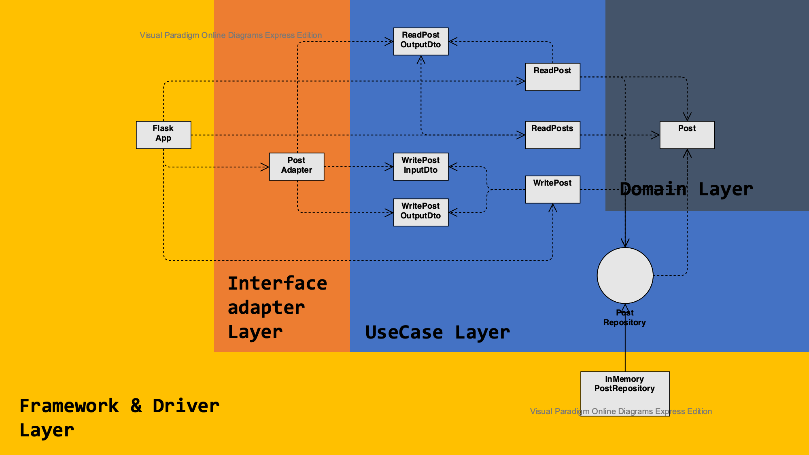

# python-clean-architecture-example
A example python code of robert martin' clean architecture

### Project Structure

```
.
├── README.md
├── adapter
│   └── post_adapter.py
├── data
│   └── in_memory_post_repository.py
├── domain
│   ├── dto
│   │   ├── read_post.py
│   │   └── write_post.py
│   ├── entity
│   │   └── post.py
│   ├── exception
│   │   └── repository.py
│   ├── interface
│   │   └── post_repository.py
│   └── use_case
│       ├── read_post.py
│       ├── read_posts.py
│       └── write_post.py
└── main.py
```

### Project Architecture


